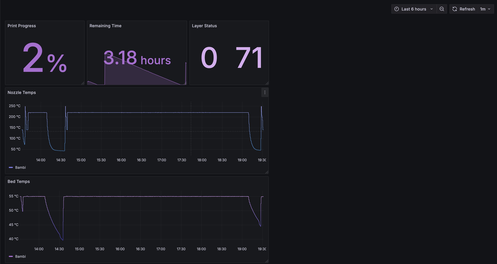

# Bambu Metrics Prometheus Exporter

This project provides a lightweight Python-based exporter that collects telemetry data from a Bambu Labs P1S 3D printer and exposes it via a native Prometheus `/metrics` HTTP endpoint. This allows the printer’s status and telemetry (bed temperature, nozzle temperature, job progress, and more) to be scraped directly by Prometheus and visualized in Grafana for advanced monitoring.



---

## Features

- Collects real-time Bambu Labs printer telemetry  
- Exposes a Prometheus-compatible `/metrics` endpoint  
- Supports easy containerized deployment with Docker and Docker Compose  
- Designed for direct integration with Prometheus + Grafana for rich visualization  

---

## Prerequisites

Before you begin, make sure you have:

- A Bambu Labs printer on your local network with LAN mode enabled  
- Access to its IP address, serial number, and API access code  
- Docker and Docker Compose installed on your deployment host  
- (Optional) A Prometheus + Grafana stack to visualize and store the metrics  

---

## Installation

1. **Clone this repository**

```bash
git clone https://github.com/your-org/bambu-metrics-mqtt.git
cd bambu-metrics-mqtt
```

2. Configure environment variables

Edit docker-compose.yml and adjust these variables under the bambu_bridge service:  
* BAMBU_IP – IP address of your Bambu printer  
* ACCESS_CODE – API access code from the Bambu app/printer dashboard  
* SERIAL – the printer's serial number  
* POLL_INTERVAL – in seconds between telemetry polls  

3. Build and deploy  
```bash
docker-compose build
docker-compose up -d
```

⸻

Usage

Once deployed, the exporter will continuously poll your printer’s telemetry and expose metrics on the HTTP endpoint at port 8000, typically at:  
`http://<host-ip>:8000/metrics`  

You can then configure Prometheus to scrape this endpoint directly to collect the printer telemetry and visualize it in Grafana.

⸻

Troubleshooting  
- Ensure your printer is reachable on the network and the IP is correct  
- Verify that Prometheus is configured to scrape the exporter’s HTTP port (default 8000)  
- Check your Prometheus scrape configuration and logs to confirm metrics are being collected  

For deeper support, please refer to the docker-compose logs and verify telemetry is flowing correctly.

⸻

License

This project is licensed under the MIT License. See LICENSE for details.

⸻

Happy printing and monitoring!